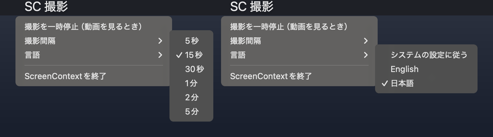

# ScreenContext

[English README](README.md)

ScreenContext は前面ウィンドウを記録し、OS 内蔵の OCR で文字を読み取り、暗号化したローカル履歴に保存します。その履歴を [Model Context Protocol (MCP)](https://modelcontextprotocol.io) で AI アシスタントに提供します。Claude Code、Claude Desktop、Cursor、VS Code、Windsurf、Codex CLI、Gemini CLI など、MCP に対応したクライアントから利用できます。

「さっきブラウザで見ていたエラーメッセージを探して」「今朝読んだ仕様書のページは？」のように依頼して使います。

| プラットフォーム | 状態 |
|---|---|
| macOS 14 以降 | 対応（メニューバーアプリ + CLI） |
| Windows 10/11 | **ベータ版**（操作ウィンドウ + CLI）。多様な実機環境での検証はまだ限られています。 |

ライセンス: [MIT](LICENSE)

## 仕組み

役割を絞った 3 つのプロセスで動きます。

1. **撮影**（macOS はメニューバーアプリ、Windows は操作ウィンドウ）: 前面の 1 ウィンドウだけをネイティブ解像度で取得します。知覚ハッシュで似た画面を省き、暗号化したスプールに書き込みます。
2. **indexer**: OCR（macOS は Apple Vision、Windows は `Windows.Media.Ocr`）を実行し、除外ポリシーを適用して、SQLCipher のデータベースとトライグラム FTS5 索引に保存します。
3. **MCP サーバー**（`screen-context serve`）: MCP クライアントが起動します。撮影コードを読み込まず、データベースを読むだけです。すべての結果に「信頼できない観測データ」のラベルを付けます。

詳細は [docs/ARCHITECTURE.md](docs/ARCHITECTURE.md)（英語）を参照してください。今後の計画は [docs/ROADMAP.ja.md](docs/ROADMAP.ja.md)にあります。

## 必要なもの

- Python 3.11 以降と [uv](https://docs.astral.sh/uv/)
- macOS 14 以降、または Windows 10/11（ベータ）
- py2app で macOS の `.app` をビルドする場合は python.org 版か Homebrew 版の Python を使ってください。一部のスタンドアロン版 Python は `zlib` が組み込みのため py2app で失敗します。

## はじめかた（macOS）

```sh
git clone https://github.com/ikeikeikeda66/screen-context-agent.git
cd screen-context-agent
uv sync --locked --extra macos --extra encrypted --extra dev
.venv/bin/screen-context init
```

`init` は `~/Library/Application Support/ScreenContext` を作成し、ランダムな暗号鍵を macOS のキーチェーンに保存します。鍵を失うと履歴を復号できません。

ターミナルで indexer を起動します。

```sh
.venv/bin/screen-context index --watch
```

メニューバーアプリをビルドして起動します。画面収録の権限は .app に付与されるため、撮影はターミナルではなくアプリから行います。

```sh
# "-" はローカル用のアドホック署名です。再ビルド後も画面収録の権限を
# 維持するには Developer ID の署名を指定してください。
SCREEN_CONTEXT_SIGN_IDENTITY=- sh packaging/build_mac.sh
open dist/ScreenContext.app
```

システム設定 > プライバシーとセキュリティ > 画面収録で ScreenContext を許可し、アプリを開き直してください。ログイン時に indexer を起動する方法は [packaging/macos/README.md](packaging/macos/README.md)（英語）を参照してください。

ターミナル自身の権限で 1 回だけ試す場合は `.venv/bin/screen-context capture --once` を使います。

### メニューバー



記録中は **SC 撮影**、一時停止中は **SC 停止** と表示されます（英語設定では **SC Rec** / **SC Paused**）。

- **撮影を一時停止 / 撮影を再開**: 動画を見るときや、見せたくない内容を表示するときに使います。状態は保存されます。
- **撮影間隔**: 5秒、15秒（既定）、30秒、1分、2分、5分。再起動せずに反映されます。画面に変化がなければ保存しません。
- **言語**: システムの設定に従う / English / 日本語。メニュー、ダイアログ、生成する素材の文言がすべてこの設定に従います。

## MCP クライアントの接続

使っているクライアント用の設定を出力します。

```sh
.venv/bin/screen-context mcp-config --client claude-code     # `claude mcp add` コマンドを出力
.venv/bin/screen-context mcp-config --client claude-desktop
.venv/bin/screen-context mcp-config --client cursor
.venv/bin/screen-context mcp-config --client vscode
.venv/bin/screen-context mcp-config --client windsurf
.venv/bin/screen-context mcp-config --client codex           # ~/.codex/config.toml 用の TOML
.venv/bin/screen-context mcp-config --client gemini
.venv/bin/screen-context mcp-config --client generic         # 汎用の mcpServers JSON
```

クライアントが stdio でサーバーを自動起動します。クライアント別の設定先と HTTP 接続は [docs/MCP-CLIENTS.md](docs/MCP-CLIENTS.md)（英語）を参照してください。

### プロファイルとツール

サーバープロセスごとにプロファイルが 1 つに固定されます。ツールの引数で変更することはできません。

| ツール | `standard`（既定） | `full` |
|---|---|---|
| `search_screen_history` | ○ | ○ |
| `get_recent_activity` | ○ | ○ |
| `get_context_around` | ○ | ○ |
| `get_day_material`（日報・日記の根拠） | ○ | ○ |
| `get_activity_timeline` | | ○ |
| `get_daily_rollup` | | ○ |
| `get_diary_material` | | ○ |
| `get_capture_health` | | ○ |
| `get_activity_delta`（署名付き cursor、固定スナップショット） | | ○ |
| `submit_proposal`（提案 outbox へ書き込み） | | ○ |
| `get_snapshot_image` | | ○ |
| `get_current_screen`（呼び出しごとにローカルで承認） | | ○ |

- `standard` はコーディングアシスタント向けです。IDE とターミナルの画面（ポリシーの `ide_apps`）を返しません。アシスタントはソースコードを直接読めるためです。
- `full` は、スクリーンショットやタイムラインを渡してよい個人用エージェント向けです。
- 旧バージョンの `claude_code` と `openclaw` は、それぞれ `standard` と `full` の別名として引き続き使えます。

すべての応答とレコードに `source=observed_screen`、`trust=untrusted` を付けます。これはラベルであり、プロンプトインジェクションを防ぐものではありません。画面の文字は命令ではなくデータとして扱ってください。

## プライバシーと保存

データフォルダの `policy.json` を編集します。撮影時とすべての問い合わせ時に読み直すため、追加した除外は過去の記録の検索・活動要約・画像取得にも適用されます。不正な設定は処理を失敗させ、除外を無効にはしません。

| キー | 意味 |
|---|---|
| `denied_apps` | 撮影しないバンドル ID（macOS）またはプロセス名（Windows）。既定でパスワード管理アプリとビデオ会議アプリを含みます。 |
| `denied_domains` | OCR した文字にこれらのドメインが含まれる画面を破棄します。URL が表示され、正しく読み取れた場合に限り有効です。 |
| `denied_title_patterns` | ウィンドウタイトルに適用する正規表現。 |
| `ide_apps` | `standard` プロファイルで返さないアプリ。 |
| `ai_output_apps`, `ai_output_title_patterns` | アシスタント自身の出力を表示している画面。提案の根拠には使えません。 |

- スプールとプレビュー画像は AES-GCM、データベースと全文索引は SQLCipher で暗号化します。鍵は OS の資格情報保管庫（キーチェーン / Windows 資格情報マネージャー）、またはヘッドレス環境では `SCREEN_CONTEXT_KEY` に置きます。
- スプールは 100 枚または 512 MB で受け付けを止めます。24 時間以上処理されない画像は `maintain` で削除します。
- 90 日経過したプレビュー画像と OCR の座標情報を削除します。検索用の OCR テキストと日次集約は保持します。
- `audit.jsonl` にはクライアント、時刻、ツール、引数の SHA-256、返却件数を記録します。検索語そのものは保存しません。
- `SCREEN_CONTEXT_PLAINTEXT=1` は開発時のテスト専用です。暗号化が使えないときに自動で平文へ切り替えることはありません。

## 設定

| 環境変数 | 用途 |
|---|---|
| `SCREEN_CONTEXT_HOME` | データフォルダ。既定は `~/Library/Application Support/ScreenContext`（macOS）、`%USERPROFILE%\.screen-context`（Windows）。 |
| `SCREEN_CONTEXT_KEY` | 64 桁の 16 進数。OS の資格情報保管庫の代わりに使います（ヘッドレス環境）。 |
| `SCREEN_CONTEXT_LANG` | `en` または `ja`。保存した言語設定より優先します。 |
| `SCREEN_CONTEXT_OCR_LANGUAGES` | OCR 言語をカンマ区切りで指定（例: `en-US,ja-JP`）。macOS の既定は `ja-JP,en-US`、Windows の既定はユーザーの表示言語です（Windows OCR は先頭の 1 言語のみ使用）。 |
| `SCREEN_CONTEXT_CLIENT` | 監査ログに記録するクライアント名。 |
| `SCREEN_CONTEXT_TOKEN` | HTTP 接続用の Bearer トークン（32 文字以上）。 |

言語は `screen-context language en|ja|system` でも設定できます。

## CLI

```text
screen-context init                 データフォルダ・鍵・DB を作成（DB 移行も実行）
screen-context index [--watch]      スプールの画像を OCR して保存
screen-context capture [--once]     ターミナルから撮影（開発用）
screen-context pause | resume       新しい撮影を停止・再開
screen-context status | health      待ち行列と各プロセスの状態
screen-context maintain             保持期間の処理と日次集約
screen-context serve [--profile standard|full] [--transport stdio|http] [--port 8765]
screen-context mcp-config [--client NAME] [--profile standard|full]
screen-context language [system|en|ja]
screen-context diary-material DATE [--budget 6000] [--lang en|ja]
screen-context proposal prepare|simulate|finish
screen-context export DATE | push DATE
```

### 任意機能: 日記の素材と定期提案

- `diary-material DATE` は 1 日分の画面履歴を、文字数上限つきの Markdown にまとめて出力します。日記や日報のプロンプトの入力に使います。
- `proposal prepare` はスケジューラー（cron やエージェントフレームワーク）の事前スクリプトとして使う想定です。新しい観測があるときだけ素材を出力し、ないときは最終行に `{"wakeAgent": false, ...}` を出力するので、エージェントの起動を省略できます。エージェントは `submit_proposal` で提案を登録します。根拠はアシスタント以外の画面からの引用である必要があり、同じ結論は 24 時間抑制されます。`proposal finish --run-id ID --response-file FILE` で実行を閉じます。

### 任意機能: OpenViking への出力

`export DATE` は日次集約の JSON を `exports/` に平文で出力します。`push DATE` はそれをローカルの [OpenViking](https://github.com/volcengine/OpenViking) サーバー（`http://127.0.0.1:1933`、必要なら `VIKING_API_KEY`）へ送ります。自動では送信しません。出力済みのデータは、後から除外を追加しても取り消されません。

## Windows（ベータ版）

Windows 版には操作ウィンドウ（開始・一時停止・停止・言語・MCP クライアント設定の表示）と同じ CLI があります。**ベータ版**です。Windows API を模擬した自動テストには合格していますが、実機での確認（DPI、複数モニター、ロックと復帰、資格情報）はまだ限られています。問題があれば Issues で報告してください。

セットアップ、配布用ビルド、受け入れ確認の手順は [docs/WINDOWS.md](docs/WINDOWS.md)（英語）を参照してください。

## 開発

```sh
uv sync --locked --extra macos --extra encrypted --extra dev   # Windows では --extra windows
.venv/bin/python -m pytest -q
.venv/bin/python packaging/verify_bundle.py                    # macOS アプリのビルド後
```

コントリビューションを歓迎します。[CONTRIBUTING.md](CONTRIBUTING.md) を参照してください。セキュリティ上の問題は [SECURITY.md](SECURITY.md) の方法で報告してください。
