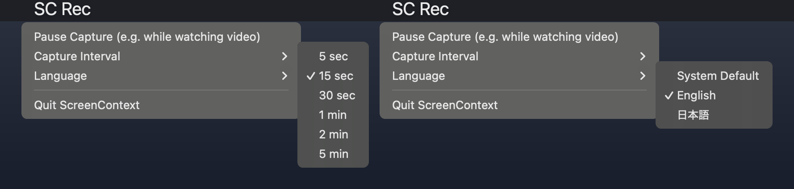

# ScreenContext

[日本語版 README はこちら](README.ja.md)

ScreenContext records the foreground window, reads its text with the operating system's built-in OCR, keeps an encrypted local history, and exposes that history to AI assistants through the [Model Context Protocol (MCP)](https://modelcontextprotocol.io). Any MCP client can use it: Claude Code, Claude Desktop, Cursor, VS Code, Windsurf, Codex CLI, Gemini CLI and others.

Ask your assistant things like "find the error message I was looking at in the browser a moment ago" or "what was the spec page I read this morning?".

| Platform | Status |
|---|---|
| macOS 14+ | Supported (menu bar app + CLI) |
| Windows 10/11 | **Beta** (control window + CLI). Not yet validated on a wide range of hardware. |

License: [MIT](LICENSE)

## How it works

Three processes, each with a narrow job:

1. **Capture** (menu bar app on macOS, control window on Windows) captures only the foreground window at native resolution. Similar frames are skipped with a perceptual hash. Frames go to an encrypted spool.
2. **Indexer** runs OCR (Apple Vision on macOS, `Windows.Media.Ocr` on Windows), applies your exclusion policy, and stores text in an SQLCipher database with a trigram FTS5 index.
3. **MCP server** (`screen-context serve`) is started by your MCP client. It never imports capture code, only reads the database, and labels every result as untrusted observed data.

More detail: [docs/ARCHITECTURE.md](docs/ARCHITECTURE.md). Planned work: [docs/ROADMAP.md](docs/ROADMAP.md).

## Requirements

- Python 3.11 or later and [uv](https://docs.astral.sh/uv/)
- macOS 14 or later, or Windows 10/11 (beta)
- To build the macOS `.app` with py2app, use a python.org or Homebrew Python. Some standalone Python builds fail in py2app because `zlib` is built in.

## Quick start (macOS)

```sh
git clone https://github.com/ikeikeikeda66/screen-context-agent.git
cd screen-context-agent
uv sync --locked --extra macos --extra encrypted --extra dev
.venv/bin/screen-context init
```

`init` creates `~/Library/Application Support/ScreenContext` and stores a random encryption key in the macOS Keychain. If you lose the key, the history cannot be decrypted.

Start the indexer in one terminal:

```sh
.venv/bin/screen-context index --watch
```

Build and start the menu bar app. macOS grants Screen Recording permission to the app bundle, so capture runs from the app, not from the terminal:

```sh
# "-" makes an ad-hoc signature for local use. Use a Developer ID identity
# to keep the Screen Recording permission across rebuilds.
SCREEN_CONTEXT_SIGN_IDENTITY=- sh packaging/build_mac.sh
open dist/ScreenContext.app
```

Allow ScreenContext in System Settings > Privacy & Security > Screen Recording, then open the app again. To start the indexer at login, see [packaging/macos/README.md](packaging/macos/README.md).

For a one-time test with the terminal's own permission: `.venv/bin/screen-context capture --once`.

### Menu bar



The menu bar shows **SC Rec** while recording and **SC Paused** while paused.

- **Pause Capture / Resume Capture**: use this while watching video or showing private content. The state is saved.
- **Capture Interval**: 5 s, 15 s (default), 30 s, 1 min, 2 min or 5 min. The change applies without a restart. Unchanged screens are not saved again.
- **Language**: System Default, English or 日本語. All menu text, dialogs, and generated material follow this setting.

## Connect an MCP client

Print a ready-to-paste entry for your client:

```sh
.venv/bin/screen-context mcp-config --client claude-code     # prints a `claude mcp add` command
.venv/bin/screen-context mcp-config --client claude-desktop
.venv/bin/screen-context mcp-config --client cursor
.venv/bin/screen-context mcp-config --client vscode
.venv/bin/screen-context mcp-config --client windsurf
.venv/bin/screen-context mcp-config --client codex           # TOML for ~/.codex/config.toml
.venv/bin/screen-context mcp-config --client gemini
.venv/bin/screen-context mcp-config --client generic         # plain mcpServers JSON
```

The client starts the server itself over stdio. Run `init` first: each `mcp-config` run issues a token for that client and embeds it in the entry. Running it again for the same client replaces the token, so the old entry stops working. The first time a new token is used, the menu bar app (or the Windows control window) asks whether that client may read your screen history; the app must be running, or approve it with `screen-context clients approve NAME`. `screen-context clients list` shows the clients and when each last read your history; `clients revoke NAME` cuts one off at its next call. Per-client instructions and the HTTP transport are in [docs/MCP-CLIENTS.md](docs/MCP-CLIENTS.md).

### Profiles and tools

Each server process runs with one fixed profile. A tool call cannot raise it.

| Tool | `standard` (default) | `full` |
|---|---|---|
| `search_screen_history` | yes | yes |
| `get_recent_activity` | yes | yes |
| `get_context_around` | yes | yes |
| `get_day_material` (evidence for a daily report or diary) | yes | yes |
| `get_activity_timeline` | | yes |
| `get_daily_rollup` | | yes |
| `get_diary_material` | | yes |
| `get_capture_health` | | yes |
| `get_activity_delta` (signed cursor, fixed snapshot) | | yes |
| `submit_proposal` (writes to the proposal outbox) | | yes |
| `get_snapshot_image` | | yes |
| `get_current_screen` (asks for local approval on every call) | | yes |

- `standard` is for coding assistants. It hides frames from IDEs and terminals (`ide_apps` in the policy), because the assistant already has the source.
- `full` is for a personal agent that you trust with screenshots and timelines.
- The names `claude_code` and `openclaw` from earlier versions still work as aliases for `standard` and `full`.

Every response and record carries `source=observed_screen` and `trust=untrusted`. This is a label, not a defense against prompt injection: treat screen text as data, never as instructions.

## Privacy and storage

Edit `policy.json` in the data folder. It is read again on every capture and every query, so a new exclusion also hides past records from search, activity summaries and images. An invalid policy makes processing fail; it never disables exclusions.

| Key | Meaning |
|---|---|
| `denied_apps` | Bundle IDs (macOS) or process names (Windows) never captured. Defaults include password managers and video-call apps. |
| `denied_domains` | Frames whose OCR text shows these domains are dropped. Detection depends on the URL being visible and read correctly. |
| `denied_title_patterns` | Regular expressions matched against window titles. |
| `ide_apps` | Hidden from the `standard` profile. |
| `ai_output_apps`, `ai_output_title_patterns` | Frames showing an assistant's own output. Proposals cannot use them as evidence. |
| `sensitive_detectors` | Default `card_number` (13–19 digits, issuer prefix, Luhn check) and `my_number` (12 digits with a valid check digit near a 個人番号/マイナンバー label). A frame that matches is dropped whole, text and image, before anything is stored; only the reason is counted. |
| `sensitive_apps`, `sensitive_title_patterns`, `sensitive_url_patterns` | Default exclusions for the contacts app and for checkout and payment pages (by title or by a `/checkout`, `/payment` or `/billing` path in a visible URL). |

| `pii_combinations` | Default `name+address`, `name+phone`, `name+dob`, `name+email`: signals within 5 OCR lines of each other (`name+phone:3` sets another window). Those lines become `[personal data]`, the rest of the frame stays searchable, and no preview image is stored. Names are found only through labels (氏名, お名前, フリガナ, `Name:`) and the 〇〇 様 form. Check a text with `screen-context pii-check FILE`. |

The `sensitive_*` and `pii_combinations` rules are on by default; set a key to `[]` to turn that rule off. An invalid rule stops processing instead of being skipped. These rules are risk based: they target input whose leak causes direct harm. They do not define personal information (under Japanese law a name alone can already be personal information). Rules apply to new frames. To apply them to frames recorded earlier, run `screen-context pii-scan` (counts only), then `pii-scan --apply`: matching frames are dropped or redacted exactly as the indexer would today, previews of redacted frames are deleted, and rollups and proposal evidence follow. No undo.

- Spool files and preview images use AES-GCM. The database and full-text index use SQLCipher. The key lives in the OS credential store (Keychain or Windows Credential Manager), or in `SCREEN_CONTEXT_KEY` for headless use.
- The spool stops accepting frames at 100 files or 512 MB. Unprocessed frames older than 24 hours are deleted by `maintain`.
- After 90 days, preview images and OCR bounding boxes are deleted. Searchable OCR text and daily rollups are kept.
- `screen-context purge` deletes frames for good: by time (`--from`/`--to`, or `--last 15m`), `--app`, `--keyword`, one `--block`, or `--excluded` (everything the current policy already hides). Selectors combine. Without `--yes` it only reports what would go, including which clients already received those frames and which of your exports included them. With `--yes` it also deletes the previews, unindexed spool files in the time range, the rollups' copies, proposal evidence that quoted the frames, and the query text and frame IDs in audit rows that returned them. Freed database pages are overwritten. There is no undo. Frames that already left the machine cannot be recalled.
- The audit log is a table in the encrypted database. For every tool call it records the client, time, tool, query text, other arguments, and the IDs of the frames returned, so you can see what each client read. It is never served over MCP; read it with `screen-context audit list` or `audit export` (plaintext JSON Lines, which is itself logged). `init` imports an older `audit.jsonl` and deletes it.
- `SCREEN_CONTEXT_PLAINTEXT=1` is for development tests only. ScreenContext never falls back to plaintext on its own.

## Configuration

| Environment variable | Purpose |
|---|---|
| `SCREEN_CONTEXT_HOME` | Data folder. Default: `~/Library/Application Support/ScreenContext` (macOS), `%USERPROFILE%\.screen-context` (Windows). |
| `SCREEN_CONTEXT_KEY` | 64 hex characters. Replaces the OS credential store (headless use). |
| `SCREEN_CONTEXT_LANG` | `en` or `ja`. Overrides the saved language. |
| `SCREEN_CONTEXT_OCR_LANGUAGES` | Comma-separated OCR languages, for example `en-US,ja-JP`. macOS default: `ja-JP,en-US`. Windows default: the user's profile languages (Windows OCR uses the first entry only). |
| `SCREEN_CONTEXT_CLIENT_TOKEN` | The client's token, set by `mcp-config`. The server refuses to start without a valid one. |

The language can also be set with `screen-context language en|ja|system`.

## CLI reference

```text
screen-context init                 create the data folder, key and database (also migrates)
screen-context index [--watch]      OCR and store spooled frames
screen-context capture [--once]     capture from the terminal (development)
screen-context pause | resume       stop or restart new captures
screen-context status | health      queue and worker state
screen-context maintain             retention and daily rollups
screen-context serve [--profile standard|full] [--transport stdio|http] [--port 8765]
screen-context mcp-config [--client NAME] [--profile standard|full] [--name TOKEN_NAME]
screen-context clients list | approve NAME | revoke NAME
screen-context language [system|en|ja]
screen-context diary-material DATE [--budget 6000] [--lang en|ja]
screen-context proposal prepare|simulate|finish
screen-context purge [--from T] [--to T] [--last 15m] [--app ID] [--keyword TEXT] [--block ID] [--excluded] [--yes]
screen-context pii-check FILE           which sensitive-input rules a text would trigger
screen-context pii-scan [--apply]       apply the rules to frames recorded earlier
screen-context audit list|export [--client NAME] [--since YYYY-MM-DD] [--limit N]
screen-context export DATE | push DATE
```

### Optional: diary material and periodic proposals

- `diary-material DATE` prints a compact, bounded Markdown summary of one day, for use as input to a diary or daily report prompt.
- `proposal prepare` is designed as a pre-run script for a scheduler (cron or an agent framework). It prints material only when there are new observations. Otherwise its last line is `{"wakeAgent": false, ...}`, so the scheduler can skip starting the agent. The agent registers a suggestion with `submit_proposal`; evidence must be a quote from a non-assistant frame, and the same conclusion is suppressed for 24 hours. Close the run with `proposal finish --run-id ID --response-file FILE`.

### Optional: OpenViking export

`export DATE` writes a daily rollup JSON to `exports/` (plaintext). `push DATE` sends it to a local [OpenViking](https://github.com/volcengine/OpenViking) server at `http://127.0.0.1:1933` (`VIKING_API_KEY` if needed). Nothing is pushed automatically. Exported data is not removed when you later add exclusions.

## Windows (beta)

The Windows version has a control window (start, pause, stop, language, MCP client setup) and the same CLI. It is **beta**: it passes automated tests with simulated Windows APIs, but real-device coverage (DPI, multiple monitors, lock and resume, credential store) is still limited. Please report problems in Issues.

Setup, portable build, and the acceptance checklist: [docs/WINDOWS.md](docs/WINDOWS.md).

## Development

```sh
uv sync --locked --extra macos --extra encrypted --extra dev   # use --extra windows on Windows
.venv/bin/python -m pytest -q
.venv/bin/python packaging/verify_bundle.py                    # after building the macOS app
```

Contributions are welcome. See [CONTRIBUTING.md](CONTRIBUTING.md). Report security issues as described in [SECURITY.md](SECURITY.md).
