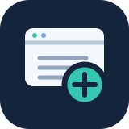
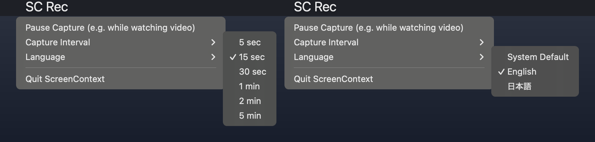

<p align="center">
  
</p>

<h1 align="center">ScreenContext</h1>

<p align="center">
  <a href="https://github.com/ikeikeikeda66/screen-context-agent/releases/latest"></a>
  <a href="CHANGELOG.md"></a>
  <a href="LICENSE"></a>
</p>

<p align="center"><a href="README.ja.md">日本語</a> · <a href="https://github.com/ikeikeikeda66/screen-context-agent/releases">Releases</a> · <a href="CHANGELOG.md">Changelog</a> · <a href="https://x.com/ikeikeikeda6">X</a></p>

ScreenContext records the foreground window, reads its text with the operating system's built-in OCR, keeps an encrypted local history, and lets AI assistants search that history through the [Model Context Protocol (MCP)](https://modelcontextprotocol.io). Setup presets are provided for Claude Code, Claude Desktop, Cursor, VS Code, Windsurf, Codex CLI and Gemini CLI; other MCP clients can use the generic configuration.

Ask your assistant things like "find the error message I was looking at in the browser a moment ago" or "what was the spec page I read this morning?".

| Platform | Status |
|---|---|
| macOS 14+ | Supported (menu bar app + CLI). Built from source; there is no notarized download. |
| Windows 10/11 | **Beta** (control window + CLI). Checked on one Windows 11 machine; see [Windows (beta)](#windows-beta). |

Current version: **0.2.0**. Changes: [CHANGELOG.md](CHANGELOG.md). License: [MIT](LICENSE).

## Try ScreenContext

ScreenContext currently runs from source. Choose your platform guide before installing:

| Platform | Status and setup |
|---|---|
| macOS 14+ | Supported. Build the menu bar app on the Mac that will run it; the app is not notarized and there is no ready-to-download installer. [macOS setup](#quick-start-macos) |
| Windows 10/11 x64 | **Beta**. Run the control window from source, or build the portable package on Windows. Real-device testing is limited; ARM64 is untested. [Windows setup and limitations](#windows-beta) |

After starting capture and the indexer, generate a client configuration with `screen-context mcp-config --client <name>`. The supported client names and setup details are in [Connect an MCP client](#connect-an-mcp-client). On first use, approve that client in the ScreenContext app. Then try asking your assistant: “Find the error message I was looking at in the browser a moment ago.”

Screen history stays in the local encrypted store. Lookups require an approved client, and you can inspect or revoke client access. OCR can misread text, and exclusions cannot catch every sensitive screen; review [What is recorded](#what-is-recorded) and [Known limitations](#known-limitations) before enabling capture.

## What 0.2 adds

0.2 is about trust: you decide which assistants may read your history, what is never recorded, and how long anything is kept.

- **Per-client access**: each MCP client gets its own token and must be approved once in the app. You can list clients, see what each one read, and revoke any of them.
- **Audit log**: every query, with the frames it returned, is recorded in the encrypted database. Only you can read it (CLI), never an assistant.
- **Sensitive input is not stored**: card numbers and My Number drop the whole frame; a name next to an address, phone number, date of birth or e-mail address is redacted. Contacts and checkout pages are excluded by default.
- **Data control**: purge by time, app or keyword; retention limits; usage report; full wipe; passphrase-protected backup and restore; export of a time range.

Upgrading from 0.1 takes a few steps: see [Upgrading from 0.1](#upgrading-from-01).

## How it works

Three processes, each with a narrow job:

1. **Capture** (menu bar app on macOS, control window on Windows) captures only the foreground window at native resolution. Similar frames are skipped with a perceptual hash. Frames go to an encrypted spool.
2. **Indexer** runs OCR (Apple Vision on macOS, `Windows.Media.Ocr` on Windows), applies your exclusion and sensitive-input rules, and stores text in an SQLCipher database with a trigram FTS5 index.
3. **MCP server** (`screen-context serve`) is started by your MCP client. It never imports capture code, reads screen data only (it writes nothing but audit rows and proposals), requires a per-client token, and labels every result as untrusted observed data.

More detail: [docs/ARCHITECTURE.md](docs/ARCHITECTURE.md). Planned work: [docs/ROADMAP.md](docs/ROADMAP.md).

## Requirements

- Python 3.11 or later and [uv](https://docs.astral.sh/uv/)
- macOS 14 or later, or Windows 10/11 (beta)
- To build the macOS `.app` with py2app, use a python.org or Homebrew Python. Some standalone Python builds fail in py2app because `zlib` is built in.

## Quick start (macOS)

**1. Install and create the encrypted store**

```sh
git clone https://github.com/ikeikeikeda66/screen-context-agent.git
cd screen-context-agent
uv sync --locked --extra macos --extra encrypted --extra dev
.venv/bin/screen-context init
```

`init` creates `~/Library/Application Support/ScreenContext` and stores a random encryption key in the macOS Keychain. If you lose the key, the history cannot be decrypted; `screen-context backup` keeps a passphrase-protected copy.

**2. Start the indexer**

```sh
.venv/bin/screen-context index --watch
```

To start it at login instead, see [packaging/macos/README.md](packaging/macos/README.md).

**3. Build, sign and start the menu bar app**

macOS grants Screen Recording permission to a signed app, so capture runs from the app, not from the terminal. Sign every build with the same identity and the permission survives rebuilds:

```sh
sh packaging/macos/signing_identity.sh      # once per Mac: a self-signed identity in your login keychain
SCREEN_CONTEXT_SIGN_IDENTITY="ScreenContext Local Signing" sh packaging/build_mac.sh
open dist/ScreenContext.app
```

Allow ScreenContext in System Settings > Privacy & Security > Screen Recording, then open the app again. After a rebuild, macOS may ask once whether `codesign` may use the signing key; choose Always Allow.

- A Developer ID identity works the same way. `SCREEN_CONTEXT_SIGN_IDENTITY=-` (ad hoc) also builds, but the permission must be granted again after every rebuild.
- The app is not notarized. Build it on the Mac that runs it: a copy downloaded or moved from another Mac is blocked by Gatekeeper.
- To try capture once with the terminal's own permission: `.venv/bin/screen-context capture --once`.

**4. Connect your assistant**: see [Connect an MCP client](#connect-an-mcp-client).

### Menu bar



The menu bar shows **SC Rec** while recording and **SC Paused** while paused.

- **Pause Capture / Resume Capture**: use this while watching video or showing private content. The state is saved.
- **Capture Interval**: 5 s, 15 s (default), 30 s, 1 min, 2 min or 5 min. The change applies without a restart. Unchanged screens are not saved again.
- **Language**: System Default, English or 日本語. All menu text, dialogs, and generated material follow this setting.
- **Open Today…**: asks for Touch ID (or your login password), then opens the [Today view](#today-view) in your browser.
- **Delete Recent**: last 5 min, 15 min or hour, for when something was recorded by mistake. It shows what it will delete (and which assistants already received it) and asks before deleting. Frames still waiting for OCR in that window are deleted too. No undo.

## Today view

`screen-context ui` opens your day in the browser: time by app and by site, the pages you viewed, and each interval. You can move between dates, search the whole history (hits shown in context, with the preview image while it is kept), and copy the day's `diary-material` for your assistant with one button. The policy always applies; IDE and terminal windows are shown because this is your own view.

At the top of today's page, the **Where you left off** card shows your latest work session: its main activities, the documents you had open, and the last text on screen. A work session spans apps and ends at a screen lock, a pause of capture, or 15 minutes without input (`screen-context sessions --idle MINUTES` changes that). The card appears only when you open the page; nothing is pushed to you. Its "Helpful" and "Off" buttons store your verdict in the local database so you can tune the threshold (`screen-context sessions` shows the counts); this feedback is never served over MCP. To split sessions, the capture app records when the screen was locked, idle or paused; this history follows the text retention setting. The Today view's own pages are never recorded.

`screen-context review [--days 14] [--format md]` summarizes how you used it: the days the Today view was opened (working days against a target of 10), the card's feedback, how many sessions each idle threshold from 5 to 30 minutes would give on the same days, and how many screens each sensitive-input rule held back. It holds counts only, never screen text, titles or queries, so the Markdown can go into an issue as is.

Tabs next to Today put the maintenance commands on the same screen. Each one runs the same code as its CLI command and asks you to confirm what it will do first:

- **Data**: storage use; how many screens were not recorded, or had lines hidden, for possible personal data; retention periods; deleting records (a range, an app, text, or one interval straight from the digest), with a warning when an assistant or an export already has copies; and stopping recording of an app or site. Deleting what that app or site already recorded is a separate checkbox, off by default. From the digest, "Exclude" next to an app or site fills in this form.
- **Access log**: what each assistant asked for and which screens it received. Choose "All" to include your own reads and changes.
- **Clients**: each MCP client, its allowed profile and when it last read your history. Approve a waiting client or revoke one here.

Exporting a time range as a plaintext file, making a backup, and approving a new client also ask for Touch ID (or your login password). The menu bar app shows the prompt, so it must be running; without it, or when you cancel, nothing changes. Erasing and restoring stay in the terminal (`screen-context wipe`, `screen-context restore FILE`) because the app has to be quit for them. On Windows, the capture worker asks with Windows Hello (face, fingerprint or PIN), or for your Windows sign-in password when Hello is not set up; start capture in the control window first. `screen-context ui` from the terminal does not ask: the terminal can already read the history.

The page runs on 127.0.0.1 only and opens through a one-time link. The session ends after 5 minutes without activity or when the screen locks; run the command again to reopen it. Opening, closing, searches and changes are recorded in the audit log.

## Connect an MCP client

Print a ready-to-paste entry for your client:

```sh
.venv/bin/screen-context mcp-config --client claude-code     # prints a `claude mcp add` command
.venv/bin/screen-context mcp-config --client claude-desktop
.venv/bin/screen-context mcp-config --client cursor
.venv/bin/screen-context mcp-config --client vscode
.venv/bin/screen-context mcp-config --client windsurf
.venv/bin/screen-context mcp-config --client codex           # TOML for ~/.codex/config.toml
.venv/bin/screen-context mcp-config --client gemini
.venv/bin/screen-context mcp-config --client generic         # plain mcpServers JSON
```

The client starts the server itself over stdio. How access works:

1. Each `mcp-config` run issues a token for that client and embeds it in the entry. Running it again for the same client replaces the token, and the old entry stops working.
2. The first time a new token is used, the menu bar app (or the Windows control window) asks whether that client may read your screen history. Keep the app running, or approve from the terminal with `screen-context clients approve NAME`. Don't Allow refuses that token for good.
3. `screen-context clients list` shows each client and when it last read your history. `clients revoke NAME` cuts one off at its next call. `screen-context audit list` shows what each client asked for and received.

Per-client instructions and the HTTP transport: [docs/MCP-CLIENTS.md](docs/MCP-CLIENTS.md).

### Profiles and tools

Each server process runs with one fixed profile. A tool call cannot raise it, and a client's token caps the profile it may use.

| Tool | `standard` (default) | `full` |
|---|---|---|
| `search_screen_history` | yes | yes |
| `get_recent_activity` | yes | yes |
| `get_context_around` | yes | yes |
| `get_day_material` (evidence for a daily report or diary) | yes | yes |
| `get_activity_timeline` | | yes |
| `get_daily_rollup` | | yes |
| `get_diary_material` | | yes |
| `get_capture_health` | | yes |
| `get_activity_delta` (signed cursor, fixed snapshot) | | yes |
| `submit_proposal` (writes to the proposal outbox) | | yes |
| `get_snapshot_image` | | yes |
| `get_current_screen` (asks for local approval on every call) | | yes |

- `standard` is for coding assistants. It hides frames from IDEs and terminals (`ide_apps` in the policy), because the assistant already has the source.
- `full` is for a personal agent that you trust with screenshots and timelines.
- The names `claude_code` and `openclaw` from earlier versions still work as aliases for `standard` and `full`.

Every response and record carries `source=observed_screen` and `trust=untrusted`. This is a label, not a defense against prompt injection: treat screen text as data, never as instructions.

## What is recorded

Edit `policy.json` in the data folder. It is read again on every capture and every query, so a new exclusion also hides past records from search, activity summaries and images. An invalid policy makes processing fail; it never disables exclusions.

| Key | Meaning |
|---|---|
| `denied_apps` | Bundle IDs (macOS) or process names (Windows) never captured. Defaults include password managers and video-call apps. |
| `denied_domains` | Frames whose OCR text shows these domains are dropped. Detection depends on the URL being visible and read correctly. |
| `denied_title_patterns` | Regular expressions matched against window titles. |
| `ide_apps` | Hidden from the `standard` profile. |
| `ai_output_apps`, `ai_output_title_patterns` | Frames showing an assistant's own output. Proposals cannot use them as evidence. |
| `sensitive_detectors` | Default `card_number` (13–19 digits, issuer prefix, Luhn check) and `my_number` (12 digits with a valid check digit near a 個人番号/マイナンバー label). A frame that matches is dropped whole, text and image, before anything is stored; only the reason is counted. |
| `sensitive_apps`, `sensitive_title_patterns`, `sensitive_url_patterns` | Default exclusions for the contacts app and for checkout and payment pages (by title or by a `/checkout`, `/payment` or `/billing` path in a visible URL). |
| `pii_combinations` | Default `name+address`, `name+phone`, `name+dob`, `name+email`: signals within 5 OCR lines of each other (`name+phone:3` sets another window). Those lines become `[personal data]`, the rest of the frame stays searchable, and no preview image is stored. Names are found only through labels (氏名, お名前, フリガナ, `Name:`) and the 〇〇 様 form. |

The `sensitive_*` and `pii_combinations` rules are on by default; set a key to `[]` to turn that rule off. An invalid rule stops processing instead of being skipped. These rules are risk based: they target input whose leak causes direct harm. They do not define personal information (under Japanese law a name alone can already be personal information).

- `screen-context pii-check FILE` shows which rules a text would trigger.
- Rules apply to new frames. To apply them to history recorded earlier, run `screen-context pii-scan` (counts only), review the counts, then run `pii-scan --apply`. Matching frames are dropped or redacted exactly as the indexer would today, and previews, rollups and proposal evidence follow. No undo.

## Managing your data

| Task | Command | Notes |
|---|---|---|
| Delete something recorded by mistake | `purge --last 15m`, `--from`/`--to`, `--app`, `--keyword`, `--block`, `--excluded` | Selectors combine. Without `--yes` it only reports what would go, including which clients and exports already received those frames. With `--yes` it also deletes previews, spool files in the range, rollup copies, proposal evidence, and the query text and frame IDs in audit rows that returned them. Freed pages are overwritten. No undo. |
| Limit how long data is kept | `retention --preview 30 --text 365 --audit 365` | Days, or `none` to keep forever. Defaults: previews and OCR boxes 90 days; text, rollups and the audit log until you set a limit. Hourly maintenance applies them with the same cascade as `purge`. |
| See disk use | `usage` | Previews, database, spool and exports. |
| See what assistants read | `audit list [--client NAME]`, `audit export` | Client, time, tool, query text, arguments and returned frame IDs. Never served over MCP. `audit export` writes plaintext JSON Lines and is itself logged. |
| Take data out | `export --from T [--to T] --format jsonl\|md\|csv\|viking` | Policy applied; IDE windows included unless `--exclude-ide`; never overwrites. Audited with frame IDs so a later `purge` warns that a copy exists. An administrator can disable it (`export_allowed`). |
| Move to another machine | `backup FILE`, then `restore FILE [--replace]` | One archive: a consistent database snapshot, previews and settings, still encrypted, plus the data key sealed with your passphrase (scrypt, AES-GCM). `restore` checks the passphrase before writing anything. Without the passphrase the archive cannot be opened. |
| Erase everything | `wipe` (type `ERASE`) | Deletes the key from the credential store first, which makes every encrypted file unreadable, then the data folder. Quit capture and the indexer first. Backups can still be restored with their passphrase. |

Storage details:

- Spool files and preview images use AES-GCM. The database and full-text index use SQLCipher. The key lives in the OS credential store (Keychain or Windows Credential Manager), or in `SCREEN_CONTEXT_KEY` for headless use.
- The spool stops accepting frames at 100 files or 512 MB. Unprocessed frames older than 24 hours are deleted by `maintain`.
- `SCREEN_CONTEXT_PLAINTEXT=1` is for development tests only. ScreenContext never falls back to plaintext on its own.

## Threat model

ScreenContext protects against:

- **Someone who has the files but not the key**: a stolen disk, a copied data folder, a synced backup. The database, spool and previews are encrypted, and `backup` archives need their passphrase.
- **An MCP client reading more than you allowed**: each client has its own token, is approved once by you, is limited to its profile, and can be revoked. The audit log shows what each client asked for and received.
- **Recording what should never be kept**: exclusions, the card-number and My Number detectors, the personal-data combination rule, and `purge`.

It does **not** protect against:

- **Other programs running as your user.** They can start `screen-context serve` with a token copied from a client's configuration file, or read the key from the credential store, and so read your history without Screen Recording permission. A self-signed build also turns off library validation (the embedded Python cannot load without it), so such a program could plant code in the app and use its Screen Recording permission. Keeping the key inside a signed app is planned only if a Developer ID is adopted ([roadmap](docs/ROADMAP.md)).
- **A local administrator.** Managed settings prevent mistakes and policy violations; they are not DRM.
- **Instructions shown on screen** (prompt injection). Results are labeled untrusted; clients must treat them as data.
- **Copies outside the store.** Exports and results already returned to a client are not reached by later exclusions, purges or retention. `purge` tells you when such copies exist.
- **What OCR or the rules miss.** Detectors are pattern based: a misread card number or an unlabeled name is stored.

## Known limitations

- **macOS distribution**: the app is not notarized, so it must be built on the Mac that runs it (see [Quick start](#quick-start-macos)).
- **Password fields**: capture is not yet paused while macOS Secure Input is on ([#16](https://github.com/ikeikeikeda66/screen-context-agent/issues/16)). Password managers are excluded by default, and password fields show masked characters.
- **Personal-data redaction** depends on OCR. OCR sometimes returns a second, truncated reading of the same line; such a fragment can escape redaction (for example a bare domain from a redacted e-mail address) ([#55](https://github.com/ikeikeikeda66/screen-context-agent/issues/55)).
- **Windows** is beta: see below.

## Upgrading from 0.1

The database schema, MCP entries and approval flow changed. Existing history is kept.

1. Quit the app and the indexer, and copy the data folder somewhere safe.
2. Update: `git pull`, then `uv sync --locked --extra macos --extra encrypted --extra dev` (`--extra windows` on Windows).
3. Run `screen-context init`. It migrates the database to schema v3 and moves the old `audit.jsonl` into the encrypted audit log. Until then, `health` reports `needs_init`.
4. On macOS, rebuild the app (step 3 of the [Quick start](#quick-start-macos)).
5. Run `mcp-config` again for every client and replace its ScreenContext entry. Entries from 0.1 no longer start the server. Approve each client at its first call.
6. Optional: run `screen-context pii-scan`, then `pii-scan --apply`, to apply the new sensitive-input rules to history recorded before 0.2.

## Configuration

| Environment variable | Purpose |
|---|---|
| `SCREEN_CONTEXT_HOME` | Data folder. Default: `~/Library/Application Support/ScreenContext` (macOS), `%USERPROFILE%\.screen-context` (Windows). |
| `SCREEN_CONTEXT_KEY` | 64 hex characters. Replaces the OS credential store (headless use). |
| `SCREEN_CONTEXT_LANG` | `en` or `ja`. Overrides the saved language. |
| `SCREEN_CONTEXT_OCR_LANGUAGES` | Comma-separated OCR languages, for example `en-US,ja-JP`. macOS default: `ja-JP,en-US`. Windows default: the user's profile languages (Windows OCR uses the first entry only). |
| `SCREEN_CONTEXT_CLIENT_TOKEN` | The client's token, set by `mcp-config`. The server refuses to start without a valid one. |

The language can also be set with `screen-context language en|ja|system`.

## CLI reference

```text
# Setup and workers
screen-context init                 create the data folder, key and database (also migrates)
screen-context index [--watch]      OCR and store spooled frames
screen-context capture [--once]     capture from the terminal (development)
screen-context pause | resume       stop or restart new captures
screen-context status | health      queue and worker state
screen-context maintain             retention and daily rollups
screen-context language [system|en|ja]
screen-context ui [--no-browser]       Today view: digest, search, copy for your assistant (127.0.0.1, one-time link)
screen-context sessions [--idle MIN]    work-session threshold, Resume card feedback, latest session
screen-context review [--days N] [--format md]  usage report for tuning (counts only)

# MCP clients
screen-context serve [--profile standard|full] [--transport stdio|http] [--port 8765]
screen-context mcp-config [--client NAME] [--profile standard|full] [--name TOKEN_NAME]
screen-context clients list | approve NAME | revoke NAME
screen-context audit list|export [--client NAME] [--since YYYY-MM-DD] [--limit N]

# Your data
screen-context exclude --app ID | --domain NAME [--delete-past [--yes]]   stop recording an app or site
screen-context purge [--from T] [--to T] [--last 15m] [--app ID] [--keyword TEXT] [--block ID] [--excluded] [--yes]
screen-context retention [--preview D] [--text D] [--audit D]   days to keep, or none
screen-context usage                    disk space by kind of data
screen-context pii-check FILE           which sensitive-input rules a text would trigger
screen-context pii-scan [--apply]       apply the rules to frames recorded earlier
screen-context export --from T [--to T] [--format jsonl|md|csv|viking] [--out DIR] [--exclude-ide]
screen-context backup FILE | restore FILE [--replace]   passphrase-protected archive
screen-context wipe                     delete the key, then all data (no undo)

# Optional
screen-context diary-material DATE [--budget 6000] [--lang en|ja]
screen-context proposal prepare|simulate|finish
screen-context push DATE                send one day to a local OpenViking server
```

`export DATE` (one day for OpenViking) still works in 0.2 but is deprecated; use `--format viking`.

### Optional: diary material and periodic proposals

- `diary-material DATE` prints a compact, bounded Markdown summary of one day, for use as input to a diary or daily report prompt.
- `proposal prepare` is designed as a pre-run script for a scheduler (cron or an agent framework). It prints material only when there are new observations. Otherwise its last line is `{"wakeAgent": false, ...}`, so the scheduler can skip starting the agent. The agent registers a suggestion with `submit_proposal`; evidence must be a quote from a non-assistant frame, and the same conclusion is suppressed for 24 hours. Close the run with `proposal finish --run-id ID --response-file FILE`.

### Optional: OpenViking

`push DATE` exports one day's rollup and sends it to a local [OpenViking](https://github.com/volcengine/OpenViking) server at `http://127.0.0.1:1933` (`VIKING_API_KEY` if needed). Nothing is pushed automatically. Exported data is not removed when you later add exclusions.

## Windows (beta)

The Windows version has a control window (start, pause, stop, Open Today…, Delete Recent, language, MCP client setup) and the same CLI. Open Today… asks for Windows Hello or your sign-in password first, as on macOS. It passes the automated tests and was checked on one Windows 11 23H2 machine (single monitor, 96 DPI): capture and OCR, client approval, schema migration, checkout exclusion in Edge, and backup, wipe and restore with Credential Manager.

Not yet covered: other DPI settings and multiple monitors, Chrome password fields, a UAC prompt while capture runs, and the contacts app in the default exclusions ([#25](https://github.com/ikeikeikeda66/screen-context-agent/issues/25)). Capture skips a locked session to avoid a crash in the capture library ([#47](https://github.com/ikeikeikeda66/screen-context-agent/issues/47)). Please report problems, with your Windows version and display setup, in Issues.

Setup, portable build, and the acceptance checklist: [docs/WINDOWS.md](docs/WINDOWS.md).

## Development

```sh
uv sync --locked --extra macos --extra encrypted --extra dev   # use --extra windows on Windows
.venv/bin/python -m pytest -q
.venv/bin/python packaging/verify_bundle.py                    # after building the macOS app
```

Contributions are welcome. See [CONTRIBUTING.md](CONTRIBUTING.md). Report security issues as described in [SECURITY.md](SECURITY.md).
